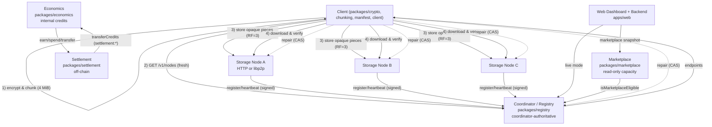

# OpenStore — Decentralized Encrypted Storage Network

Open-source storage where every file is encrypted on your device before it leaves, chunked into 4 MiB pieces, replicated across independently operated nodes, and verified end-to-end on download.

> **Status:** Research implementation. Milestones 061C–072 are complete on `main` for local and Docker testnet validation. Physical multi-machine live testing was deferred; current testnet validation is Docker Compose on localhost. Not yet a production deployment.

## What is OpenStore?

OpenStore is a TypeScript/Node.js reference implementation of a decentralized, client-side encrypted storage network. Files are chunked, encrypted with a per-file random DEK and fresh IVs, stored as opaque encrypted pieces on multiple storage nodes, and reconstructed only by the owner who holds the manifest and the DEK. The current control plane is **coordinator-authoritative** (a single trusted coordinator for placement), while storage itself is distributed.

## Why OpenStore

Centralized storage requires trusting the provider with plaintext. Existing decentralized options often lack verifiable client-side encryption, safe provider lifecycle, or auditable integrity. OpenStore addresses:

- opaque storage: providers never see plaintext or keys
- user-owned encryption and recovery
- explicit capacity sharing without silent data loss
- replication and repair that fail closed rather than pretending success
- a path toward a capacity marketplace without conflating it with payments

It does not yet claim to replace centralized durability or to provide absolute guarantees.

## Impact

- **Privacy-preserving storage:** AES-256-GCM encryption happens on the client; ciphertext only is stored and transferred.
- **User-controlled encryption:** per-file DEK, per-chunk IV, piece-hash verification; encrypted local keystore with Ed25519 identity and OpenStore Recovery Phrase v1 (not BIP39).
- **Distributed participation:** anyone can run a storage node (HTTP or libp2p/Noise) and register with the coordinator.
- **Provider-owned capacity:** sharing uses an explicit, isolated directory and hard quota; OpenStore never claims free space automatically.
- **Resilience:** replication factor `3` on three nodes by default, integrity verification on every replica, bounded retry and repair that preserves manifest CAS.
- **Future marketplace participation:** capacity discovery is live today; pricing/payments are explicitly not yet implemented and remain separate from discovery.

## Core Principles

1. **Client-side encryption is mandatory.** Storage nodes receive only opaque `bytes` indexed by `pieceId` (`[A-Za-z0-9_-]{1,128}`); they reject `key`/`encryptionKey` fields.
2. **Keys never leave the client process** except as an encrypted keystore file (scrypt + XChaCha20-Poly1305, `0600`). Private keys are zeroed (`fill(0)`) after use.
3. **Coordinator is authoritative for placement/control-plane**, not for plaintext. Fresh coordinator data is required for new placement/repair; existing manifests can be read/deleted via their recorded replicas during an outage (fail-closed, never inventing replacements).
4. **No automatic authority election/failover.** A second coordinator does not become authoritative merely because the first is unreachable; split-brain is handled by failing closed.
5. **Decentralized does not mean coordinator-less today.** Storage is distributed; the current control plane still has a single trusted coordinator. The long-term vision is more decentralized, but the implementation is explicit about this boundary.

## How It Works

**Client encryption:** `packages/crypto` implements AES-256-GCM. `uploadBuffer` generates a fresh per-file DEK, encrypts each 4 MiB plaintext chunk with a fresh IV, encodes an encrypted-piece envelope, and derives `pieceId = SHA-256(ciphertext)` and `plaintextHash`. The manifest stores only piece IDs, sizes, hashes, and replica `nodeIds` — never the DEK.

**Chunking:** `packages/chunking` splits files into fixed 4 MiB plaintext chunks (last chunk may be smaller) and reassembles in order. Opaque pieces may be up to ~8 MiB after encryption/encoding.

**Placement:** `apps/client/selection.ts` selects from `registry.listAvailable()` for an available node with `lifecycle==="sharing"` and `availableBytes >= pieceSize`, ordered by most `availableBytes` then reliability. Placement requires a fresh `GET /v1/nodes` (or libp2p discovery refresh) — stale data never authorizes new replicas.

**Replication:** The client stores the same encrypted piece independently on `replicationFactor` distinct eligible nodes via `MixedStorageTransport` (HTTP or libp2p/Noise).

**Integrity:** `downloadBuffer` fetches each chunk from its replica set, verifies `SHA-256(piecematches expected pieceId)`, decrypts with the vaulted DEK, and checks `plaintextHash`/`plaintextSize` before returning bytes. Corrupt replicas are skipped; `hash mismatch` fails closed.

**Repair:** `apps/client/repair.ts` and `apps/client/repair-scheduler.ts` observe a manifest-listed replica as unavailable across consecutive fresh coordinator snapshots (grace window), fetch a surviving replica's opaque bytes, verify the hash, store it on a fresh eligible target, and CAS-update the manifest `A+B → A+C` (never persisting a reduced-replica intermediate).

**Provider lifecycle:** `apps/web/provider.ts` + `apps/storage-node/capacity-allocation.ts` + `provider-allocation-lifecycle.ts` implement `sharing → draining → released`. `sharing` accepts stores; `draining` rejects new stores (`503`) while serving reads for migration/repair; `released` remains unavailable until an explicit resume/rejoin.

**Marketplace / Economics / Settlement:** Marketplace (`packages/marketplace`) is a backend-authoritative, read-only listing of `availableBytes` for `lifecycle==="sharing"` nodes (fail-closed for HTTP `lifecycle===undefined`). Economics (`packages/economics`) is an internal integer-safe credit ledger (`1 credit / GiB-hour`, `BigInt` floor, append-only). Settlement (`packages/settlement`) is an internal off-chain transfer (`consumer -amount`, `provider +amount`, same `amount`, `totalSupply` unchanged) with deterministic `settlement.id` idempotency (`pending→finalized|rejected|failed`). None are cryptocurrency, no blockchain is used.

## Architecture Overview



*Single-process coordinator with atomic `tmp+fsync+rename+dir fsync` persistence (`packages/registry:529-581`). HA contracts exist in `packages/coordinator-ha` (replica bootstrap/sync/authority) but only the HTTP coordinator is deployed; no automatic promotion.*

## Security and Privacy

**Guarantees (within the current implementation):**
- Plaintext and per-file DEKs never sent to storage nodes; nodes enforce this (`POST /pieces` rejects `key`/`encryptionKey`).
- Every replica is content-addressed and verified before use (piece SHA-256, envelope, AES-GCM auth tag, plaintext hash/size).
- Ed25519 identities with encrypted keystores (scrypt `N=32768,r=8,p=1` + XChaCha20-Poly1305) and deterministic libp2p `PeerId` binding.
- Signed coordinator `REGISTER`/`HEARTBEAT`/`UNREGISTER` with replay protection, rate limits, and sanitized metrics/events/conditions (never `privateKey`, `recoveryPhrase`, `DEK`, `plaintext`, `piece bytes`, `token` in logs).
- Draining rejects new placement while preserving reads; release is blocked while pieces remain.

**Limitations (honest):**
- Coordinator is a single trusted point; no BFT/Raft, no automatic failover, no revocation authority beyond operator drills.
- Transport is `libp2p-noise` or plain HTTP on loopback; no TLS/mTLS termination, cert rotation, or network segmentation is deployed.
- Ledger/metrics/events are process-local, bounded, and reset on restart (no durable alerting/SIEM exporter yet).
- DHT discovery (`@libp2p/kad-dht`) is not placement authority; `discovery-state` is `fresh/cached/stale/unavailable` with 30 s lease / 5 min retention.
- Deleted-file DEKs remain in the local vault until explicitly handled; orphan pieces are retained fail-closed unless `orphanCleanup.enabled`.
- This is not an audited, production-hardened deployment; physical multi-machine testing was deferred.

## Provider Model

Anyone can share part of a local disk:

```text
sharing → draining → released
```

- **Setup:** Choose an *empty* directory or an already-marked OpenStore directory (`.openstore-storage` marker). An explicit `capacityBytes` (e.g., `512` MiB) is required; it must not exceed `statfs` free space and must cover existing piece bytes. A fresh Ed25519 identity is generated and stored as `openstore-identity.json` encrypted with `OPENSTORE_PROVIDER_IDENTITY_PASSWORD` (`0600`), private material is zeroed.
- **Start sharing (`sharing`):** Node registers with `coordinatorUrl`/`coordinatorToken`, heartbeats, and is `isMarketplaceEligible` (requires `lifecycle==="sharing"`, `available`, `availableBytes>0`). For HTTP nodes `lifecycle` is fail-closed as `undefined` → not marketplace-eligible until HTTP registration propagates lifecycle (see `packages/marketplace` docs).
- **Draining:** `POST /api/provider/stop` persists `draining` before setting `isDraining=true`. New stores return `503`; `GET /pieces/:id` and `GET /pieces/:id/verify` remain available so repair can migrate replicas. Capacity may be increased while draining, but decreasing below `used` is refused.
- **Released:** Only allowed when `used===0 && reserved===0` (projections exclude temp/provenance files). The provider remains `available:false` until an explicit `resumeSharing` (`sharing`) via `POST /api/provider/start`. No automatic promotion, no silent deletion of other users' replicas.
- **Allocation:** `createCapacityAllocation` enforces `allocated <= usableBytes` and `used + reserved <= allocated`. `setAllocation`/`increase`/`decrease` are validated; a shrink that would strand data is rejected with the current usage numbers.

The **Storage Nodes** page reflects authoritative backend state (lifecycle, `allocated/used/reserved/available`, eligibility, readiness `ready|draining|released|offline`, reason codes, `drainReadiness`/`releaseReadiness`) and fails closed with sanitized errors.

## Marketplace

- **What it is:** `GET /api/marketplace/providers` (and `GET /api/marketplace`) returns a backend-authoritative snapshot of `lifecycle==="sharing"` providers only. Each entry is `{id, baseUrl, lifecycle:"sharing", allocatedBytes, usedBytes, availableBytes, score, storageScore, lastSeen, transport?, available:true}` — no private keys, signatures, or piece bytes. Totals `totalAvailableBytes`/`totalAllocatedBytes` are derived from the filtered set. Ordering is deterministic: most `availableBytes`, then `score`, then `id`.
- **Filtering:** `?minAvailableBytes=&minScore=&minStorageScore=&transport=http|libp2p&limit=1..100&offset=` — validated, sanitized.
- **Not what it is:** Marketplace is **capacity discovery, not pricing**. It does not implement bidding, reservations, payments, or credits. Economics/settlement are separate.
- **Authority:** Requires a live registry (`createRegistry`); without it the endpoint fails closed `503 marketplace unavailable: coordinator not configured` rather than inventing listings. Stale/invalid `NodeRecord`s are never listed.

## Economics and Settlement

- **Internal credits, not cryptocurrency:** `packages/economics` defines `1 credit = floor(bytes*duration*1 / (GiB*hour))` via `BigInt`, `BYTES_PER_GIB=1073741824`, `MS_PER_HOUR=3600000`. `AccountId` `^[A-Za-z0-9._-]+$`.
- **Provider vs consumer:** `recordProviderContribution(providerId, NodeRecord, durationMs, eventId?)` earns `allocatedBytes`-based credits only when `isMarketplaceEligible` (sharing, available, `availableBytes>0`); HTTP `lifecycle===undefined` is fail-closed. `recordConsumerUsage(consumerId, bytes, durationMs, replicationFactor)` spends the same rate. Separate ledgers (`provider.earn` vs `consumer.spend`), separate from marketplace.
- **Ledger:** `packages/economics` maintains `Account {balance, createdAt}` and `LedgerEntry {id, timestamp, accountId, type: issuance|earn|spend, amount, delta, balanceAfter, reason}`. `getLedger()` returns copies, `id` is monotonic, no update/delete API. Balances never negative; `totalSupply == sum(issuance+earn)`, spends do not reduce `totalSupply` (allocation). All math is `Number.isSafeInteger` + `BigInt`.
- **Idempotency:** `recordProviderContribution` dedupes on `providerId|nodeId|allocated|duration|eventId` (`seenProviderEvents`). Repeating the same period returns `0` credits and no new entry; genuinely different `eventId`/`allocated`/`duration` remains a separate earning. `transferCredits` dedupes on `transfer:${eventId}|from|to|amount`.
- **Settlement:** `packages/settlement` converts economic events into finalized transfers. Primitives are `SettlementRequest {id, providerId, consumerId, providerRecord, bytes, durationMs, replicationFactor?, amount?}`, `ProviderContributionClaim`, `ConsumerCharge`, `FinalizedTransfer {from, to, amount, providerEntryId, consumerEntryId}`, `SettlementStatus pending→finalized|rejected|failed`. `requestSettlement` validates deterministically, derives `amount` via `calculateConsumerCredits` if omitted, checks `isMarketplaceEligible` and `consumerBalance>=amount`, then atomically `economics.transferCredits(consumer→provider, amount, "settlement:"+id, id)` (same `amount`, same `timestamp`, `totalSupply` unchanged). `id` is `^[A-Za-z0-9._-]+$` and makes the transfer replay-safe (`same id → same record`, no duplicate). `failed` is retryable via `retrySettlement`, `finalized`/`rejected` are terminal. No silent mutation of finalized records.

## Blockchain Decision (072)

`docs/blockchain-evaluation.md` evaluates whether OpenStore requires a blockchain for its current architecture and economics. **Conclusion: A) Blockchain not required now.**

The existing `coordinator → marketplace → economics → settlement` stack with a trusted coordinator satisfies double-spend prevention (single authoritative `seenTransfers` + `balance>=amount`), replay protection (`settlement.id`/`eventId`), and internal auditability (`getLedger`/`listSettlements`) without a chain.

A blockchain (or equivalent BFT log) would only become genuinely required for **multi-writer settlement without a trusted coordinator**, **public tamper-evident third-party audit without trusting coordinator storage**, or **trustless slashing/proof-of-storage**. Those would also publish `providerId`/`consumerId`/`amount`/`duration` metadata on-chain, increase operational cost, and expand attack surface, without closing a current gap. The evaluation recommends hardening off-chain instead (durable append-only files for `economics`/`settlement` ledgers, keeping `transferCredits` internal to `settlement`).

Speculative token/coin design, smart contracts, and consensus were explicitly not implemented.

## Current Project Status

Completed roadmap `061C`–`072` (local/Docker):

- **061C** Backup/verify/restore foundation; **Metrics/Events/Conditions** bounded sanitized observability; **Coordinator HA/recovery** safety boundaries (replica bootstrap/sync/authority, no auto-elected leader).
- **062 Network partition** explicit fail-closed placement/repair, partition-heal recovery.
- **063 Repair concurrency**, **064 Storage crash consistency** (tmp+file fsync+rename+dir fsync).
- **065 Coordinator persistence stress**, **066 Production security** (constant-time bearer, `/v1/metrics` auth gating, `maxPieceBytes`).
- **067 Adversarial/malicious-node** testing (corrupt/wrong-piece, oversized, claim validation, 12 deterministic unit tests + Docker).
- **068 Provider UX** — `sharing→draining→released` control surface, authoritative status (lifecycle, `allocated/used/reserved/available`, eligibility, readiness, reason codes), fail-closed sanitized errors, no secret leakage.
- **069 Marketplace** — backend-authoritative `GET /api/marketplace/providers`, `isMarketplaceEligible` requiring `sharing`, HTTP `undefined` fail-closed, filtering, totals, sanitized.
- **070 Economics** — internal credits (`1/GiB-hour`, `BigInt` floor), `Account`/`LedgerEntry` append-only, provider/consumer separation, `lifecycle` reuse, no fiat.
- **071 Settlement** — internal off-chain `pending→finalized|rejected|failed`, balanced `consumer -amount` / `provider +amount`, `totalSupply` unchanged, idempotent `settlement.id`=`eventId`, retry-safe, `ineligible`/`insufficient` fail-closed.
- **072 Blockchain evaluation** — `A` not required for trusted-coordinator architecture.
- Testnet: **057–057E** Docker Compose (1 coordinator + 3 libp2p nodes, isolated ports/volumes, `OPENSTORE_RUN_DOCKER_TESTNET=1`). Physical multi-machine testing was deferred.

## Quick Start

Requires Node.js 20+ and `npm`.

```sh
npm install
npm run build
```

All commands prefer environment variables for secrets so they never appear in `ps`.

**Client CLI** (`tsx apps/client/cli.ts`, `openstore`):

```sh
npm run openstore -- identity create --keystore ./openstore-identity.json --password-env OPENSTORE_PASSWORD
npm run openstore -- files list --store ./openstore-manifests
npm run openstore -- files get <fileId> --store ./openstore-manifests
```

TypeScript APIs for placement/repair:

```ts
import { createCoordinatorAdapter } from "./apps/client/coordinator.js";
import { uploadBuffer, downloadBuffer } from "./apps/client/index.js";
const coordinator = createCoordinatorAdapter({ baseUrl: "http://127.0.0.1:4190", token: process.env.OPENSTORE_COORDINATOR_TOKEN });
const { manifest, encryptionKey } = await uploadBuffer(data, "photo.jpg", [], { coordinator, replicationFactor: 3 });
```

## Running the Web Dashboard

The dashboard is the fastest way to run everything locally (registry + nodes + web in one process, loopback-only).

```sh
mkdir -p ./data/manifests ./data/node1 ./data/node2
OPENSTORE_WEB_PORT=4173 \
OPENSTORE_WEB_MANIFEST_DIR=./data/manifests \
OPENSTORE_WEB_KEYSTORE=./data/identity.json \
OPENSTORE_WEB_STORAGE_DIRS=./data/node1,./data/node2 \
OPENSTORE_WEB_STORAGE_PORTS=4101,4102 \
node dist/apps/web/server.js
# or: OPENSTORE_WEB_MANIFEST_DIR=./data/manifests OPENSTORE_WEB_STORAGE_DIRS=./data/node1,./data/node2 npm run web
```

Expected logs (never keys):

```
OpenStore storage node at http://127.0.0.1:4101/ (./data/node1)
OpenStore storage node at http://127.0.0.1:4102/ (./data/node2)
OpenStore web dashboard at http://127.0.0.1:4173/
```

| Variable | Default | Effect |
|---|---|---|
| `OPENSTORE_WEB_PORT` | `4173` | Dashboard port |
| `OPENSTORE_WEB_MANIFEST_DIR` | — (demo) | Live file catalog; unset → demo files |
| `OPENSTORE_WEB_KEYSTORE` | — (demo) | Local Ed25519 keystore; unset → demo identity |
| `OPENSTORE_WEB_STORAGE_DIRS` | — (demo) | Comma-separated storage dirs — one real node per dir |
| `OPENSTORE_WEB_STORAGE_PORTS` | ephemeral | Per-node ports matching `STORAGE_DIRS` |
| `OPENSTORE_WEB_STORAGE_CAPACITY_BYTES` | `1 GiB` | Per-node quota |
| `OPENSTORE_WEB_REGISTRY` | — | `1`/`true`: live empty registry (for provider-only start) |

Browser first-run: **Live** badge → Settings → Create identity → back up 12-word OpenStore Recovery Phrase v1 → Storage Nodes shows `http://127.0.0.1:4101` **Live** → Upload → My Files → Download (verified). Sharing: Storage Nodes → **My Storage Node** → Share Storage (empty dir + MiB) → **Start Sharing** → **Change allocation** / **Stop Sharing (draining)** / **Release storage** (only when drained + 0 pieces).

Coordinator outage: `GET /v1/nodes` is required for new placement; existing manifests remain readable/deletable via recorded replicas.

## Running Storage Nodes / Testnet

**Standalone libp2p node** (`npm run storage-node`):

```sh
npm run storage-node -- --storage-dir ./pieces \
  --identity ./openstore-identity.json --password-env OPENSTORE_PASSWORD \
  --listen /ip4/127.0.0.1/tcp/4102 \
  --capacity-bytes 1073741824 --refresh-interval-ms 5000
# repeatable --listen, optional --bootstrap <descriptor.json>, --config <json>
# with coordinator: --coordinator-url http://127.0.0.1:4190 --coordinator-token-env OPENSTORE_COORDINATOR_TOKEN
```

Supports `--config <json>` with `storageDir, identityPath, identityPassword, listenAddrs, bootstrapPeers, capacityBytes, maxPieceBytes, discoveryRefreshIntervalMs, coordinatorUrl, coordinatorToken, heartbeatIntervalMs`.

**Trusted coordinator** (loopback-only, signed envelopes, `registerSigned`/`heartbeatSigned`):

```sh
OPENSTORE_COORDINATOR_TOKEN="$(openssl rand -hex 24)" \
  npm run registry -- --port 4190 --token-env OPENSTORE_COORDINATOR_TOKEN
# HTTP: GET /v1/health, GET /v1/nodes, POST /v1/register|heartbeat|unregister
# also: GET /v1/status, /v1/metrics (/metrics), /v1/events, /v1/conditions, /recovery/*
```

**Backup** (`npm run backup`):

```sh
npm run backup -- create --destination ./backup-2026-09-17 --client-keystore ./openstore-identity.json --client-manifests ./openstore-manifests --client-operations ./openstore-manifests/.provenance-operations --client-dek ./web-vault.deks.json
npm run backup -- verify --backup ./backup-2026-09-17
npm run backup -- restore --backup ./backup-2026-09-17 --destination ./restored-state
```

**Docker testnet** (`deploy/testnet`): 1 coordinator + 3 libp2p nodes, isolated bridge, named volumes for registry/identity/pieces. See `deploy/testnet/.env.testnet` example and `docker compose config`.

**Integration gate (057E):**

```sh
OPENSTORE_RUN_DOCKER_TESTNET=1 npx vitest run tests/integration/milestone-057e.test.ts --reporter=dot
```

Always `docker compose down -v` for its temporary project.

## Development and Testing

Actual `package.json` scripts:

```sh
npm run build        # tsc
npm run typecheck    # tsc --noEmit
npm test             # vitest run
npm run test:watch   # vitest
npm run dev          # tsx
npm run openstore -- ... # tsx apps/client/cli.ts
npm run backup -- ...    # tsx apps/backup/cli.ts
npm run storage-node -- ... # tsx apps/storage-node/libp2p-cli.ts
npm run registry -- ...     # tsx apps/registry/coordinator-cli.ts
npm run web          # npm run build && node dist/apps/web/server.js
```

Focused suites: `npm test -- apps/web/provider.test.ts`, `npm test -- packages/marketplace`, `npm test -- packages/economics`, `npm test -- packages/settlement`, `npm test -- apps/web/marketplace.test.ts`.

## Project Structure

```
apps/
  client/         # uploadBuffer/downloadBuffer, selection, repair, coordinator adapter
  storage-node/   # HTTP + libp2p runtimes, capacity-allocation, provider-allocation-lifecycle
  registry/       # coordinator CLI
  web/            # backend (ProviderManager, marketplace, economics via packages), server, dashboard (store/views)
  backup/         # versioned backup/verify/restore
packages/
  crypto/         # AES-256-GCM
  chunking/       # fixed 4 MiB
  manifest/       # encrypted-piece envelope, content hashes, manifest store (CAS)
  identity/       # Ed25519, Recovery Phrase v1, encrypted keystore
  auth/           # Ed25519 request signing + replay cache
  registry/       # NodeRecord, capacity, reliability, heartbeat, persistence, discovery
  p2p/            # transport-neutral contracts, libp2p, identity-binding, DHT discovery
  placement/      # shared isPlacementEligible/hasTrustedCapacity
  marketplace/    # backend-authoritative listing (sharing only, fail-closed for HTTP undefined)
  economics/      # internal credits, append-only ledger, idempotent earn
  settlement/     # off-chain settlement (pending→finalized|rejected|failed, balanced transfer)
  coordinator-ha/ # BootstrapMachine, ReplicaImporter, SyncManager, authority (no auto-promotion)
  conditions/ discovery-state/ metrics/ events/ ...
deploy/testnet/   # Compose + Dockerfile for local testnet
docs/             # 052A, 053A-053Q, economics.md, settlement.md, blockchain-evaluation.md, local-dev.md
tests/integration/# milestone-* (044,045,046,047,048B,049A,050B,050C,057E, etc.)
```

## Limitations / Known Constraints

- **Trusted coordinator:** single authoritative writer with atomic persistence; no Raft/consensus, durable instance identity, automatic failover, or revocation — fails closed instead.
- **No TLS/mTLS, key rotation, or production network policies**; storage nodes bind `127.0.0.1` by default.
- **In-memory economics/settlement ledgers** (append-only, idempotent, but reset on restart until durable file persistence is added).
- **DHT is not placement authority;** Kademlia record lifetime only.
- **HTTP `lifecycle` gap:** `NodeRecord.lifecycle` for HTTP nodes is `undefined` in the registry (HTTP `registerSigned` only sends `capacity`); marketplace and `isMarketplaceEligible` correctly treat `undefined` as ineligible (fail-closed) for marketplace/earn.
- **Single provider per web backend**; no multi-tenant load balancing yet.
- **Uploads require live nodes;** `replicationFactor` strictly enforced (`insufficient suitable nodes` is not silently reduced).
- **Physical multi-machine testing was deferred** as noted above; Docker testnet covers the current gate.

## Roadmap / Future Work

**Completed roadmap (061C–072):** coordinator HA/recovery safety, partition resilience, repair concurrency, crash consistency, persistence stress, production hardening, adversarial testing, Provider UX (`sharing→draining→released`), Marketplace, Economics, Settlement, Blockchain evaluation (A: not required).

**Future product requirements (not a 073 roadmap, not implemented):**

- Production security: mTLS, key rotation, durable audit log, rate limiting, secrets management (KMS/HSM), security headers, SBOM scanning.
- Failure recovery: replicated registry (Raft), durable instance identity, revocation authority.
- Repair: event-driven triggers, prioritization, sub-chunk repair, source selection.
- Marketplace/Provider multi-tenancy: reputation, automated re-replication on exit, capacity bidding.
- Economics: durable ledger files, provider pricing, SLA/penalties, accounting UI.
- Blockchain *only if* cross-organization trustless settlement or public tamper-evident audit becomes a product requirement (see `docs/blockchain-evaluation.md`).

No blockchain/token/payment/consensus is planned for the current internal-credits model.

## Contributing

Open an issue or pull request on GitHub. For local work:

```sh
npm install
npm run build
npm run typecheck
npm test
```

Keep changes minimal, preserve existing HTTP behavior, keep storage-node bytes opaque, never log or transmit private keys/recovery phrases/DEKs, validate coordinator/DHT descriptors strictly, and keep `coordinator → marketplace → economics → settlement` boundaries intact. Run `git diff --check` before submitting.

## Security Reporting

No dedicated `SECURITY.md` is currently in the repository. For a potential vulnerability, **open a private security report through GitHub (Security → Report a vulnerability)** if the repository has it enabled, otherwise open a draft issue marked **private/confidential** and the maintainers will triage. Do not post private keys, recovery phrases, DEKs, plaintext file contents, or coordinator tokens in public issues.

If GitHub private reporting is unavailable in your fork, use a conservative placeholder: create a private issue titled `SECURITY: potential vulnerability` with only a non-sensitive summary and wait for a maintainer to provide a secure channel.

## License

**MIT** — see `LICENSE` if present in the distribution, otherwise `package.json:license = "MIT"`. No other license is implied.

## Acknowledgements

OpenStore stands on the shoulders of open-source cryptography and P2P work, including `libp2p` (Noise, TCP, mplex, identify, Kademlia DHT) and the Node.js/TypeScript ecosystem. No invented organizations or individuals are acknowledged; the implementation is the product of the contributors to this repository (`0xyusufz/openstore`).
